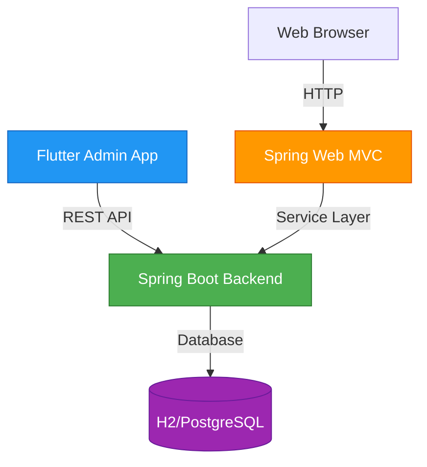
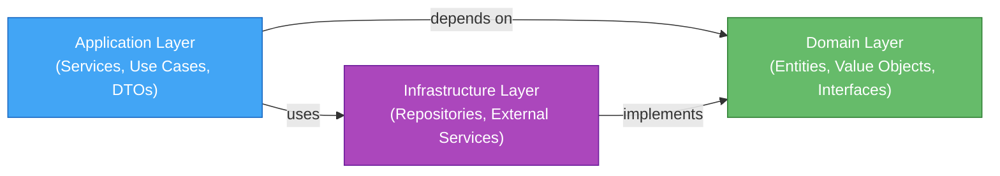
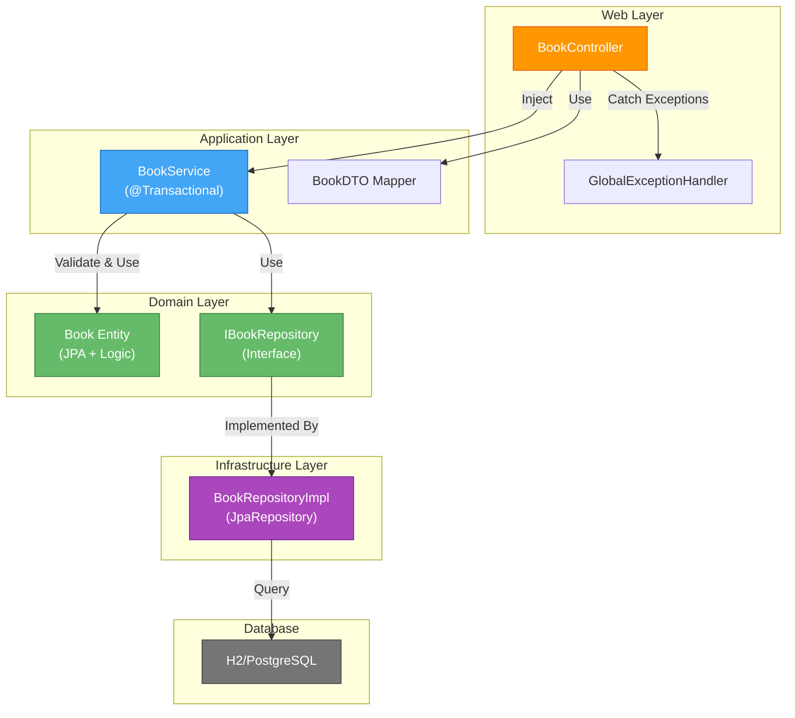
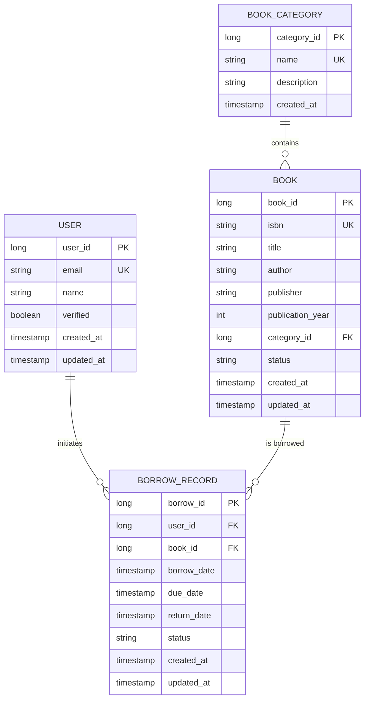
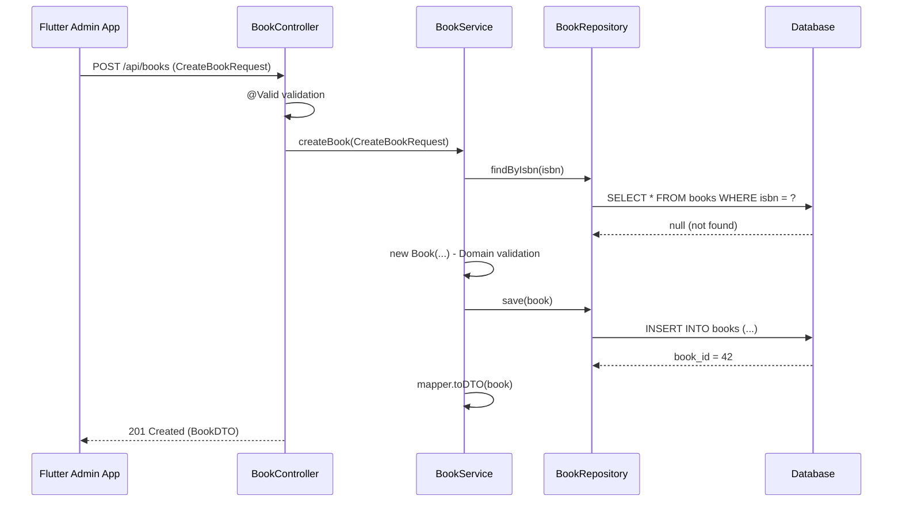

# Bookcycle - System Architecture

## 1. Overview

Bookcycle ist eine drei-schichtige Anwendungsarchitektur für ein Book-Borrowing-Management-System, bestehend aus:

- **Backend**: Spring Boot (Clean Architecture, REST API)
- **Web Frontend**: Spring Boot Web MVC (Server-Side Rendering mit Thymeleaf)
- **Admin Frontend**: Flutter (Mobile & Web-fähig)



---

## 2. Architecture Layers

### 2.1 Clean Architecture Principles

Die Anwendung folgt **Clean Architecture** unter expliziter Anwendung von Domain-Driven-Design-Prinzipien (Entities, Aggregates, Use Cases) mit strikter Trennung von Concerns:



#### **Domain Layer** (Framework-Free)
```
server/src/main/java/com/bookcycle/domain/
├── entities/
│   ├── Book.java              # JPA Entity, all business logic here
│   ├── BorrowRecord.java       # Borrow state, validation rules
│   ├── User.java               # User entity with roles
│   └── BookStatus.java         # Enum for book states
├── repositories/
│   ├── BookRepository.java     # Interface, NO implementation
│   ├── BorrowRepository.java    # Interface definition only
│   └── UserRepository.java      # Interface definition only
├── exceptions/
│   ├── BookNotFoundException.java
│   ├── BookAlreadyBorrowedException.java
│   ├── OverdueBorrowException.java
│   └── InsufficientPermissionException.java
└── value_objects/
    ├── ISBN.java               # Value object with validation
    └── BorrowPeriod.java        # Value object for date ranges
```

- **No Framework Dependencies**: Keine Spring-Annotationen in Domain-Klassen
- **Business Logic First**: Alle Geschäftsregeln in Entities/Value Objects
- **Validation at Creation**: Constructor-basierte Validierung

#### **Application Layer** (Service Interfaces & DTOs)
```
server/src/main/java/com/bookcycle/application/
├── services/
│   ├── IBookService.java       # Service interface
│   ├── IBorrowService.java      # Service interface
│   └── IUserService.java        # Service interface
├── dto/
│   ├── request/
│   │   ├── CreateBookRequest.dto.java
│   │   ├── UpdateBookRequest.dto.java
│   │   ├── CreateBorrowRequest.dto.java
│   │   └── ReturnBookRequest.dto.java
│   ├── response/
│   │   ├── BookDTO.java
│   │   ├── BorrowDTO.java
│   │   └── UserDTO.java
│   └── mapper/
│       ├── BookDTOMapper.java   # Entity ↔ DTO conversion
│       ├── BorrowDTOMapper.java
│       └── UserDTOMapper.java
└── use_cases/
    ├── BorrowBookUseCase.java  # Orchestrates services
    ├── ReturnBookUseCase.java   # Complex business flow
    └── ListAvailableBooksUseCase.java
```

- **Service Interfaces First**: Contracts before implementation
- **Separate Request/Response DTOs**: Input validation != Output serialization
- **Mapper Pattern**: Explicit Entity → DTO conversion
- **@Transactional Service Methods**: Boundary enforcement
- **Use Cases**: Orchestrate across multiple services

#### **Infrastructure Layer** (Repositories, External APIs)
```
server/src/main/java/com/bookcycle/infrastructure/
├── repositories/
│   ├── SpringDataBookRepository.java    # Extends JpaRepository
│   ├── BookRepositoryAdapter.java       # Implements IBookRepository
│   ├── SpringDataBorrowRepository.java
│   ├── BorrowRepositoryAdapter.java
│   └── ... (Repository implementations)
├── external/
│   ├── EmailService.java                # External API integration
│   └── NotificationService.java
├── config/
│   ├── JpaConfiguration.java
│   ├── SecurityConfiguration.java
│   └── RestTemplateConfiguration.java
└── migration/
    ├── V001__InitialSchema.sql
    ├── V002__AddBorrowRecords.sql
    └── ... (Liquibase/Flyway migrations)
```

- **Repository Adapters**: Implement domain interfaces using Spring Data
- **No Business Logic**: Pure persistence & external integration
- **Configuration Beans**: Beans leben hier, nicht in Services

---

### 2.2 Layer Dependencies & Data Flow



---

## 3. Entity & Database Design

### 3.1 Entity Relationship Diagram



### 3.2 Key Entity: Book

```java
@Entity
@Table(name = "books", uniqueConstraints = @UniqueConstraint(columnNames = "isbn"))
public class Book {
    
    @Id
    @GeneratedValue(strategy = GenerationType.IDENTITY)
    private Long bookId;
    
    @Column(nullable = false, unique = true)
    private String isbn;
    
    @Column(nullable = false)
    private String title;
    
    @Column(nullable = false)
    private String author;
    
    @Enumerated(EnumType.STRING)
    @Column(nullable = false)
    private BookStatus status; // AVAILABLE, BORROWED, DAMAGED, ARCHIVED
    
    @CreationTimestamp
    private LocalDateTime createdAt;
    
    @UpdateTimestamp
    private LocalDateTime updatedAt;
    
    @Column(nullable = false)
    private Long createdBy;
    
    // Constructor with validation
    public Book(String isbn, String title, String author) {
        if (isbn == null || isbn.isBlank()) throw new IllegalArgumentException("ISBN required");
        if (title == null || title.isBlank()) throw new IllegalArgumentException("Title required");
        
        this.isbn = isbn;
        this.title = title;
        this.author = author;
        this.status = BookStatus.AVAILABLE;
    }
    
    // Business methods (Domain Logic)
    public void markAsBorrowed() {
        if (this.status != BookStatus.AVAILABLE) {
            throw new BookAlreadyBorrowedException("Book is not available for borrowing");
        }
        this.status = BookStatus.BORROWED;
    }
    
    public void markAsReturned() {
        if (this.status != BookStatus.BORROWED) {
            throw new IllegalStateException("Book was not borrowed");
        }
        this.status = BookStatus.AVAILABLE;
    }
}
```

---

## 4. API Contract (OpenAPI 3.0)

### 4.1 Endpoint Overview

| HTTP Method | Endpoint | Purpose |
|---|---|---|
| GET | `/api/books` | List all books with pagination & filters |
| POST | `/api/books` | Create new book |
| GET | `/api/books/{id}` | Get book details |
| PUT | `/api/books/{id}` | Update book metadata |
| DELETE | `/api/books/{id}` | Retire/delete book |
| POST | `/api/borrows` | Borrow a book |
| PUT | `/api/borrows/{borrowId}/return` | Return borrowed book |
| GET | `/api/users/{userId}` | Get user profile |
| GET | `/health` | Service health check |

### 4.2 Request/Response Flow



---

## 5. Service Layer & Transactions

### 5.1 Service Interface Design

```java
public interface IBookService {
    
    // Query methods (read-only)
    BookDTO getBookById(Long bookId);
    Page<BookDTO> listBooks(Pageable pageable, BookFilter filter);
    boolean existsByIsbn(String isbn);
    
    // Command methods (transactional)
    BookDTO createBook(CreateBookRequest request);
    BookDTO updateBook(Long bookId, UpdateBookRequest request);
    void deleteBook(Long bookId);
}

@Service
public class BookService implements IBookService {
    
    @Transactional(readOnly = true)
    public BookDTO getBookById(Long bookId) {
        Book book = bookRepository.findById(bookId)
            .orElseThrow(() -> new BookNotFoundException("Book " + bookId + " not found"));
        return mapper.toDTO(book);
    }
    
    @Transactional  // Required: Domain validation on new Book()
    public BookDTO createBook(CreateBookRequest request) {
        // Validation
        if (bookRepository.findByIsbn(request.getIsbn()).isPresent()) {
            throw new DuplicateIsbnException("ISBN already exists: " + request.getIsbn());
        }
        
        // Domain object creation (includes validation)
        Book book = new Book(request.getIsbn(), request.getTitle(), request.getAuthor());
        
        // Persistence
        Book saved = bookRepository.save(book);
        
        // DTO conversion
        return mapper.toDTO(saved);
    }
}
```

### 5.2 Transactional Boundaries

```
✅ CORRECT:
@Service
public class BookService {
    @Transactional
    public void borrowBook(Long bookId, Long userId) {
        book.markAsBorrowed();  // Domain logic INSIDE transaction
        borrowRepository.save(record);
    }
}

❌ WRONG:
@Repository
public class BookRepository implements IBookRepository {
    @Transactional  // NO @Transactional on repositories!
    public Book save(Book book) { ... }
}
```

---

## 6. Controller Layer (Spring Web MVC & REST)

### 6.1 Web MVC Controller Example

```java
@Controller
@RequestMapping("/books")
public class BookController {
    
    private final IBookService bookService;
    private final BookDTOMapper mapper;
    
    @GetMapping
    public String listBooks(
        @RequestParam(defaultValue = "0") int page,
        Model model) {
        
        Pageable pageable = PageRequest.of(page, 20, Sort.by("title"));
        Page<BookDTO> books = bookService.listBooks(pageable, null);
        
        model.addAttribute("books", books);
        model.addAttribute("currentPage", page);
        return "books/list";  // Rendered via Thymeleaf
    }
    
    @PostMapping
    public String createBook(
        @Valid @ModelAttribute CreateBookForm form,
        BindingResult bindingResult,
        RedirectAttributes redirectAttributes) {
        
        if (bindingResult.hasErrors()) {
            return "books/form";  // Re-render with errors
        }
        
        BookDTO created = bookService.createBook(form.toRequest());
        redirectAttributes.addFlashAttribute("success", "Book created: " + created.getTitle());
        return "redirect:/books/" + created.getId();
    }
}
```

### 6.2 REST API Controller Example

```java
@RestController
@RequestMapping("/api/books")
public class BookRestController {
    
    private final IBookService bookService;
    
    @GetMapping("/{id}")
    public ResponseEntity<BookDTO> getBook(@PathVariable Long id) {
        return ResponseEntity.ok(bookService.getBookById(id));
    }
    
    @PostMapping
    public ResponseEntity<BookDTO> createBook(@Valid @RequestBody CreateBookRequest request) {
        BookDTO created = bookService.createBook(request);
        return ResponseEntity
            .created(URI.create("/api/books/" + created.getId()))
            .body(created);
    }
    
    @ExceptionHandler(BookNotFoundException.class)
    public ResponseEntity<ErrorResponse> handleNotFound(BookNotFoundException e) {
        return ResponseEntity
            .status(HttpStatus.NOT_FOUND)
            .body(new ErrorResponse("BOOK_NOT_FOUND", e.getMessage()));
    }
}
```

---

## 7. Flutter Frontend Architecture

### 7.1 State Management with Riverpod

```
                    ┌─────────────────┐
                    │   REST API      │
                    │  (BookService)  │
                    └────────┬────────┘
                             │
                    ┌────────▼────────┐
                    │   Repository    │
                    │ (BookRepository)│
                    └────────┬────────┘
                             │
    ┌────────────────────────┼────────────────────────┐
    │     Riverpod Providers                          │
    │  ┌──────────────────────────────────────────┐  │
    │  │ FutureProvider<List<Book>>               │  │
    │  │   booksProvider                          │  │
    │  └──────────────────────────────────────────┘  │
    │                    │                            │
    │     ┌──────────────┴──────────────┐            │
    │     │                             │            │
    │  ┌──▼────────────────┐    ┌───────▼───────┐   │
    │  │ selectedBookProvider│   │ createBookProvider
    │  │ (StateNotifier)    │   │ (async setter)│   │
    │  └──────────────────┘    └──────────────┘   │
    └──────────────────────────────────────────────┘
                             │
    ┌────────────────────────▼────────────────────┐
    │       Widget Tree (UI)                       │
    │  ┌─────────────────────────────────────┐    │
    │  │ BookListScreen                      │    │
    │  │  - Watch booksProvider              │    │
    │  │  - .when() → Loading/Error/Data     │    │
    │  └─────────────────────────────────────┘    │
    └────────────────────────────────────────────┘
```

### 7.2 Riverpod Provider Examples

```dart
// Data Source Layer
final bookApiProvider = Provider((ref) => BookAPI(httpClient: http.Client()));

// Repository Layer
final bookRepositoryProvider = Provider((ref) {
  final api = ref.watch(bookApiProvider);
  return BookRepository(api);
});

// Read-Only Data Provider (FutureProvider)
final booksProvider = FutureProvider.autoDispose<List<Book>>((ref) async {
  final repository = ref.watch(bookRepositoryProvider);
  return repository.getAllBooks();
});

// State Notifier for mutations
final selectedBookProvider = StateNotifierProvider.autoDispose<
    SelectedBookNotifier, 
    AsyncValue<Book?>>((ref) {
  final repository = ref.watch(bookRepositoryProvider);
  return SelectedBookNotifier(repository, null);
});

// Widget usage
class BookListScreen extends ConsumerWidget {
  @override
  Widget build(BuildContext context, WidgetRef ref) {
    final booksAsync = ref.watch(booksProvider);
    
    return booksAsync.when(
      loading: () => CircularProgressIndicator(),
      error: (error, stack) => ErrorWidget(error: error.toString()),
      data: (books) => ListView.builder(
        itemCount: books.length,
        itemBuilder: (context, index) => BookTile(book: books[index]),
      ),
    );
  }
}
```

---

## 8. Data Flow Diagrams

### 8.1 Book Borrowing Flow


### 8.2 Error Handling Flow

```mermaid
graph LR
    A[Request sent] -->|Exception thrown| B{Exception Type?}
    B -->|BookNotFoundException| C[404 - Not Found]
    B -->|BookAlreadyBorrowedException| D[409 - Conflict]
    B -->|InsufficientPermissionException| E[403 - Forbidden]
    B -->|Unexpected| F[500 - Internal Server Error]
    
    C & D & E & F -->|ErrorResponse JSON| G[GlobalExceptionHandler]
    G -->|Serialize| H[{"code": "...", "message": "..."}]
    H -->|Flutter catches| I[AsyncValue.error]
    I -->|Widget renders| J[ErrorWidget with user message]
    
    style B fill:#FF9800,stroke:#E65100,color:#fff
    style J fill:#F44336,stroke:#C62828,color:#fff
```

---

## 9. Testing Strategy

### 9.1 Test Pyramid

```
                     ▲
                    ╱ ╲
                   ╱   ╲
                  ╱ E2E ╲    (1% coverage)
                 ╱───────╲
                ╱         ╲
               ╱  Integration╲  (15% coverage)
              ╱───────────────╲
             ╱                 ╲
            ╱   Unit Tests      ╱  (84% coverage)
           ╱───────────────────╱
          ╲___________________╱

Target: 80%+ overall coverage
```

### 9.2 Test Examples

#### **Domain Layer Test** (90%+ coverage)
```java
class BookTest {
    @Test
    void testMarkAsBorrowedWhenAvailable() {
        Book book = new Book("978-3-16", "Clean Code", "Robert Martin");
        book.markAsBorrowed();
        assertThat(book.getStatus()).isEqualTo(BookStatus.BORROWED);
    }
    
    @Test
    void testMarkAsBorrowedWhenAlreadyBorrowedThrows() {
        Book book = new Book("978-3-16", "Clean Code", "Robert Martin");
        book.markAsBorrowed();
        
        assertThatThrownBy(book::markAsBorrowed)
            .isInstanceOf(BookAlreadyBorrowedException.class);
    }
}
```

#### **Service Layer Test** (80%+ coverage)
```java
class BookServiceTest {
    @Mock private IBookRepository bookRepository;
    @InjectMocks private BookService bookService;
    
    @Test
    void testCreateBookSuccess() {
        CreateBookRequest request = new CreateBookRequest("978-3-16", "Clean Code", "Martin");
        Book savedBook = new Book(request.getIsbn(), request.getTitle(), request.getAuthor());
        
        when(bookRepository.findByIsbn(request.getIsbn())).thenReturn(Optional.empty());
        when(bookRepository.save(any(Book.class))).thenReturn(savedBook);
        
        BookDTO result = bookService.createBook(request);
        
        assertThat(result.getTitle()).isEqualTo("Clean Code");
        verify(bookRepository).save(any(Book.class));
    }
}
```

#### **Controller Layer Test** (70%+ coverage)
```java
@WebMvcTest(BookRestController.class)
class BookRestControllerTest {
    @MockBean private IBookService bookService;
    @Autowired private MockMvc mockMvc;
    
    @Test
    void testCreateBookReturn201() throws Exception {
        BookDTO created = new BookDTO(1L, "978-3-16", "Clean Code", "Martin");
        when(bookService.createBook(any())).thenReturn(created);
        
        mockMvc.perform(post("/api/books")
            .contentType("application/json")
            .content("{...}"))
            .andExpect(status().isCreated())
            .andExpect(jsonPath("$.title").value("Clean Code"));
    }
}
```

#### **Flutter Widget Test**
```dart
void main() {
  group('BookListScreen', () {
    testWidgets('displays loading state', (WidgetTester tester) async {
      await tester.pumpWidget(
        ProviderContainer(
          overrides: [
            booksProvider.overrideWithValue(AsyncValue.loading()),
          ],
          child: MaterialApp(home: BookListScreen()),
        ),
      );
      
      expect(find.byType(CircularProgressIndicator), findsOneWidget);
    });
    
    testWidgets('displays books list on success', (WidgetTester tester) async {
      final books = [
        Book(id: 1, title: 'Clean Code', author: 'Martin'),
      ];
      
      await tester.pumpWidget(
        ProviderContainer(
          overrides: [
            booksProvider.overrideWithValue(AsyncValue.data(books)),
          ],
          child: MaterialApp(home: BookListScreen()),
        ),
      );
      
      expect(find.text('Clean Code'), findsOneWidget);
    });
  });
}
```

---

## 10. Technology Stack

### Backend
- **Language**: Java 17+ LTS
- **Framework**: Spring Boot 3.x
- **Build Tool**: Maven 3.8+
- **Database**: H2 (Dev), PostgreSQL (Prod)
- **Persistence**: Spring Data JPA with Hibernate
- **Testing**: JUnit 5, Mockito, AssertJ, Spring Test
- **API Documentation**: OpenAPI 3.0 / Springdoc OpenAPI

### Web Frontend
- **Framework**: Spring Boot Web MVC
- **Templating**: Thymeleaf
- **Styling**: Bootstrap 5 / CSS3
- **Testing**: Spring MockMvc, JUnit 5

### Mobile/Admin Frontend
- **Framework**: Flutter (Dart 3.x)
- **State Management**: Riverpod 2.x
- **API Client**: Dio / http
- **Data Models**: Freezed (immutable classes)
- **Testing**: Flutter Widget Tests

### DevOps
- **CI/CD**: GitHub Actions
- **Container Registry**: GHCR (GitHub Container Registry)
- **Code Quality**: SonarQube, SpotBugs, Checkstyle
- **Version Control**: Git / GitHub Flow

---

## 11. Getting Started

### 11.1 Prerequisites

```bash
# Java 17+
java -version

# Maven 3.8+
mvn -version

# Flutter & Dart
flutter --version

# Docker (optional, for local PostgreSQL)
docker --version
```

### 11.2 Backend Setup

```bash
cd server

# Build
mvn clean package

# Run
mvn spring-boot:run

# Test
mvn test

# Coverage Report
mvn jacoco:report
open target/site/jacoco/index.html
```

### 11.3 Web Frontend Setup

```bash
cd server

# Already integrated in Spring Boot MVC
# Access at http://localhost:8080
```

### 11.4 Flutter Admin Setup

```bash
cd mobile

# Get dependencies
flutter pub get

# Run on connected device
flutter run

# Run tests
flutter test

# Build APK
flutter build apk --release
```

---

## 12. API Documentation

See [OpenAPI Specification](../openapi/api-spec.yaml) for complete endpoint documentation.

### Quick Reference
- **Base URL**: `http://localhost:8080/api`
- **Health Check**: `GET /health`
- **Authentication**: JWT tokens (Future enhancement)
- **Response Format**: JSON

---

## 13. Common Patterns & Best Practices

### 13.1 Entity Creation
```java
// ✅ CORRECT: Validation in constructor
public Book(String isbn, String title, String author) {
    this.isbn = requireNonNull(isbn, "ISBN is required");
    this.title = requireNonNull(title, "Title is required");
    this.status = BookStatus.AVAILABLE;
}

// ❌ WRONG: No validation, setter-based
Book book = new Book();
book.setIsbn(isbn);  // Might be null!
```

### 13.2 DTO Mapping
```java
// ✅ CORRECT: Separate Request/Response DTOs
createBook(CreateBookRequest request) {
    // Request DTO → Domain
    Book book = new Book(request.getIsbn(), request.getTitle(), ...);
    Book saved = repository.save(book);
    // Domain → Response DTO
    return mapper.toDTO(saved);
}

// ❌ WRONG: Single DTO for request & response
book.setId(1L);  // IDs shouldn't be in request!
```

### 13.3 Transaction Boundaries
```java
// ✅ CORRECT: @Transactional on service methods
@Service
public class BookService {
    @Transactional
    public void borrowBook(Long bookId, Long userId) {
        Book book = repository.findById(bookId).orElseThrow();
        book.markAsBorrowed();  // Validates AND changes state
        borrowRepository.save(record);
    }
}

// ❌ WRONG: @Transactional on repositories
@Repository
public interface BookRepository extends JpaRepository<Book, Long> {
    @Transactional  // NO!
    Book save(Book book);
}
```

### 13.4 Error Handling
```java
// ✅ CORRECT: Custom exceptions with clear semantics
public class BookAlreadyBorrowedException extends RuntimeException {
    public BookAlreadyBorrowedException(String isbn) {
        super("Book with ISBN " + isbn + " is already borrowed");
    }
}

@RestControllerAdvice
public class GlobalExceptionHandler {
    @ExceptionHandler(BookAlreadyBorrowedException.class)
    public ResponseEntity<ErrorResponse> handle(BookAlreadyBorrowedException e) {
        return ResponseEntity.status(CONFLICT).body(
            new ErrorResponse("BOOK_ALREADY_BORROWED", e.getMessage())
        );
    }
}

// ❌ WRONG: Generic exceptions
throw new Exception("Error");
```

---

## 14. Decision Records

| Decision | Rationale |
|---|---|
| **Clean Architecture** | Clear separation of concerns, framework-independent domain layer, easier testing |
| **Repository Pattern** | Abstract persistence, multiple storage implementations possible |
| **Service Layer** | Transactional boundaries, business logic orchestration, testability |
| **DTOs** | Input/output contracts independent of entity model |
| **Riverpod** | Compile-time safe providers, auto-disposal, better than Provider |
| **JUnit 5 + Mockito** | Modern Java testing, good mocking, parameterized tests |
| **Spring Data JPA** | Reduce boilerplate, auto-generated queries, pagination support |
| **OpenAPI 3.0** | Industry standard, tooling support, client generation possible |

---

## 15. References & Further Reading

- [Clean Architecture by Robert C. Martin](https://blog.cleancoder.com/uncle-bob/2012/08/13/the-clean-architecture.html)
- [Spring Boot Documentation](https://spring.io/projects/spring-boot)
- [Flutter Best Practices](https://flutter.dev/docs/testing)
- [Riverpod Documentation](https://riverpod.dev)
- [RESTful API Design Best Practices](https://restfulapi.net/)

---

## 16. Support & Questions

- **Architecture Questions**: Review agent files in `.github/agents/`
- **Code Examples**: Check prompt library in `docs/prompts/`
- **API Reference**: See `openapi/api-spec.yaml`
- **Development Tasks**: Check `.vscode/tasks.json`
- **CI/CD Issues**: Check `.github/workflows/ci.yml`

---

**Last Updated**: 2024
**Version**: 1.0
**Maintainers**: Development Team
